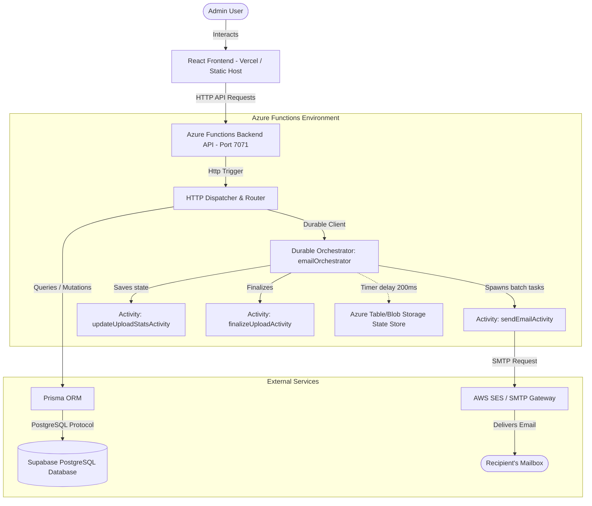
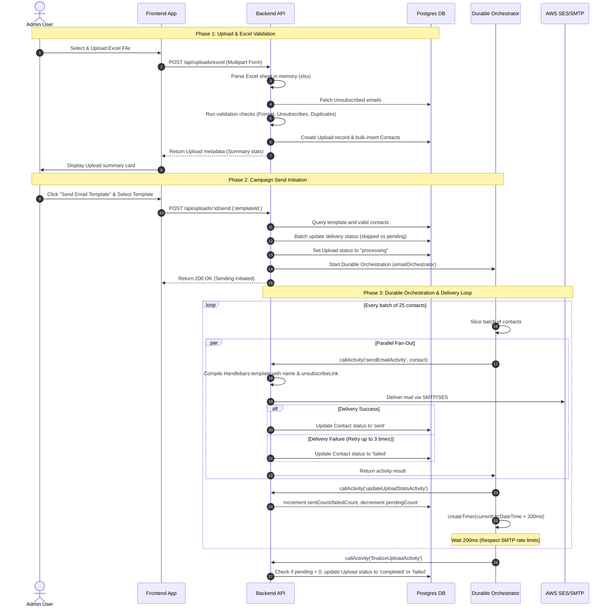

# VUF Mail Marketing System — System Architecture

This document provides a comprehensive technical overview of the VUF Mail Marketing System. It details the technologies used, the database schema, the end-to-end workflow of the email-sending pipeline, API reference details, and visual structural diagrams.

---

## 1. Physical System Architecture

The application is split into a client React SPA (Single Page Application) and a serverless Azure Functions API backend. It utilizes Supabase for database hosting, AWS SES for SMTP relay, and Azure Storage (for durable function orchestrations).



---

## 2. Technology Stack Detail

### Frontend
*   **React 18 & TypeScript:** Strict typing for props, state, and API communication.
*   **Vite:** Tooling and build engine for hot-reloading in development and tree-shaken assets in production.
*   **Tailwind CSS 3:** Utility-first CSS framework for layout styling (utilizes a dark/glassmorphic design system).
*   **React Router 6:** Client-side routing for seamless page navigation.
*   **TanStack Table (React Table v8):** Performant table layout supporting pagination and search filters for large contact lists.
*   **Axios:** HTTP client configured with request/response interceptors to handle authentication tokens (`vuf_token`) and handle token expiration (401 redirection).
*   **Lucide React:** Iconography library.

### Backend & Orchestration
*   **Azure Functions (v4 Node.js Programming Model):** Pure JavaScript serverless environment. It defines a single catch-all HTTP routing trigger matching `/api/{*segments}`.
*   **Azure Durable Functions:** An extension that lets you write stateful workflows. In this system, it replaces traditional queues (like BullMQ/Redis) to handle long-running mail-sending operations reliably without timeout issues.
*   **Prisma ORM:** Typesafe database client supporting query building, relationships, and raw transactions.
*   **Supabase (PostgreSQL):** Relational database storing persistent data like administrators, uploads, templates, and contact lists.
*   **AWS SES / Nodemailer:** AWS Simple Email Service acts as the primary SMTP provider. A fallback configuration using standard SMTP (such as Gmail SMTP) ensures high availability.
*   **Handlebars:** Template engine used to compile template content and merge variables dynamically (e.g. `{{name}}`, `{{email}}`, and `{{unsubscribeLink}}`).
*   **XLSX (SheetJS):** Used to read and parse Excel uploads completely in memory, avoiding disk space writes.

---

## 3. Database Schema Design (Prisma)

The Supabase PostgreSQL database is structured around five tables:

```mermaid
erDiagram
    admins {
        string id PK
        string email UNIQUE
        string password
        string name
        datetime created_at
        datetime updated_at
    }
    uploads {
        string id PK
        string file_name
        string original_name
        int total_rows
        int valid_emails
        int invalid_emails
        int duplicate_emails
        int unsubscribed_emails
        string status
        int total_count
        int sent_count
        int failed_count
        int pending_count
        int skipped_count
        string template_id FK
        datetime created_at
    }
    contacts {
        string id PK
        string name
        string email
        string status
        string error
        string upload_id FK
        string delivery_status
        string delivery_error
        datetime sent_at
        datetime created_at
    }
    unsubscribed {
        string id PK
        string email UNIQUE
        string token UNIQUE
        datetime created_at
    }
    templates {
        string id PK
        string name
        string subject
        string html_body
        string plain_text_body
        datetime created_at
        datetime updated_at
    }

    uploads ||--o{ contacts : "contains"
    templates ||--o{ uploads : "used in"
```

### Table Definitions
1.  **`Admin` (`admins`):** Stores credentials (hashed using bcrypt) for administrators.
2.  **`Upload` (`uploads`):** Represents an Excel upload. Keeps summary metrics and delivery statistics.
3.  **`Contact` (`contacts`):** Individual email addresses extracted from an upload. Includes delivery status tracking (`idle`, `pending`, `sent`, `failed`, `skipped`).
4.  **`Unsubscribed` (`unsubscribed`):** Unsubscribed emails list. Uses a unique cryptographic token to handle unsubscribe requests.
5.  **`Template` (`templates`):** Email layouts composed in HTML and plaintext.

---

## 4. End-to-End Email Sending Pipeline & Logic

The entire system flow, from the moment an administrator uploads a contact spreadsheet to the completion of the email delivery, is structured as follows:



### Detailed Logic Breakdown

#### 1. File Upload and Validation Logic
*   **File parsing**: The uploaded `.xlsx` file is parsed using `XLSX.read(buffer, { type: 'buffer' })`.
*   **Format normalization**: Column names are converted to lowercase and trimmed. The file must contain `name` and `email` columns.
*   **Email validation**:
    *   **Empty Email**: Status set to `invalid`, error message: `'Email is empty'`.
    *   **Format Check**: Checked using regex `/^[^\s@]+@[^\s@]+\.[^\s@]+$/`. If failed, status set to `invalid`, error message: `'Invalid email format'`.
    *   **Duplicate Check**: If the email has already been encountered in the current file, status set to `duplicate`, error message: `'Duplicate email in file'`.
    *   **Unsubscribe Check**: Queries the `Unsubscribed` table. If a match is found, status set to `unsubscribed`, error message: `'Email is unsubscribed'`.
*   **Bulk Database Insertion**: Contacts are saved in a single transactional query to optimize execution speed.

#### 2. Durable Orchestration Flow
When a campaign starts, the `emailOrchestrator` manages the lifecycle of the campaign:
1.  **Batching**: Contacts are sliced into batches of size `BATCH_SIZE` (default is `25`).
2.  **Concurrency (Fan-Out/Fan-In)**: Within a batch, tasks are executed in parallel (`Task.all(tasks)`). This drastically speeds up throughput compared to processing one contact at a time.
3.  **SMTP Rate Limiting**: Between batches, a durable timer (`context.df.createTimer(nextFireAt)`) pauses orchestration for `200ms`. Because it uses a durable timer, the runtime is suspended during the wait time and does not consume serverless execution fees or block CPU cores.
4.  **Resilience (Retries)**: The `sendEmailActivity` implements a retry loop with a 2-second delay. If an email fails due to a temporary network issue, it will retry up to 3 times before recording a permanent failure.

#### 3. Unsubscribe Flow
*   When rendering the email template, an unsubscribe link is injected: `https://<frontend-url>/unsubscribe/<token>`.
*   The token is generated deterministically: `SHA-256(email + salt)`. This prevents users from tampering with or guessing other subscribers' opt-out tokens.
*   Clicking the link requests `POST /api/unsubscribe/<token>`. The backend validates the token, inserts the email into the `unsubscribed` table, and runs `revalidateDuplicatesForEmails` to dynamically flag any matching contacts across existing lists as `unsubscribed` (so they won't receive emails in future campaigns).

---

## 5. API Endpoint Specifications

All endpoints (except public unsubscribes) require a JSON Web Token (JWT) sent via the `Authorization` header: `Bearer <token>`.

### Authentication
*   **`POST /api/auth/login`**
    *   *Payload:* `{ "email": "admin@vuf.org", "password": "..." }`
    *   *Response:* JWT Access Token and basic admin profile.
*   **`GET /api/auth/me`**
    *   *Response:* Decodes token and returns current authenticated administrator data.

### Uploads & Management
*   **`POST /api/uploads/excel`**
    *   *Payload:* Multipart form data with key `file`.
    *   *Response:* Created `Upload` record detailing row counts and validation stats.
*   **`GET /api/uploads`**
    *   *Response:* Array of all campaigns sorted by creation date descending.
*   **`GET /api/uploads/:id`**
    *   *Response:* Detailed upload information with template metadata.
*   **`GET /api/uploads/:id/contacts`**
    *   *Query parameters:* `page` (default `1`), `limit` (default `50`).
    *   *Response:* Paginated array of contacts in that upload list.
*   **`PUT /api/uploads/:id`**
    *   *Payload:* `{ "fileName": "...", "originalName": "..." }`
    *   *Response:* Updates the label of the upload record.
*   **`DELETE /api/uploads/:id`**
    *   *Response:* Cascades and deletes the upload along with all its contacts.

### Email Operations
*   **`POST /api/uploads/:id/send`**
    *   *Payload:* `{ "templateId": "..." }`
    *   *Response:* Status message indicating the campaign has been started.

### Contacts (CRUD within lists)
*   **`PUT /api/contacts/:id`**
    *   *Payload:* `{ "name": "...", "email": "..." }`
    *   *Response:* Re-evaluates validation status (checking format, duplicates, unsubscribed) for the target contact, updates the record, and recalibrates upload stats.
*   **`DELETE /api/contacts/:id`**
    *   *Response:* Deletes contact from list and recalculates upload stats.

### Templates
*   **`GET /api/templates`**
    *   *Response:* List of saved templates.
*   **`POST /api/templates`**
    *   *Payload:* `{ "name": "...", "subject": "...", "htmlBody": "...", "plainTextBody": "..." }`
    *   *Response:* Created template record.
*   **`PUT /api/templates/:id`**
    *   *Payload:* JSON representation of updated template properties.
    *   *Response:* Updated template record.
*   **`DELETE /api/templates/:id`**
    *   *Response:* Removes template record.
*   **`POST /api/templates/:id/test`**
    *   *Payload:* `{ "testEmail": "..." }`
    *   *Response:* Dispatches a test mail immediately using mock template inputs.

### Unsubscribe (Public)
*   **`GET /api/unsubscribe/:token`**
    *   *Response:* Checks if the token corresponds to an already unsubscribed address.
*   **`POST /api/unsubscribe/:token`**
    *   *Payload:* `{ "email": "..." }`
    *   *Response:* Adds the email address to the unsubscribed table and flags matching list contacts.
