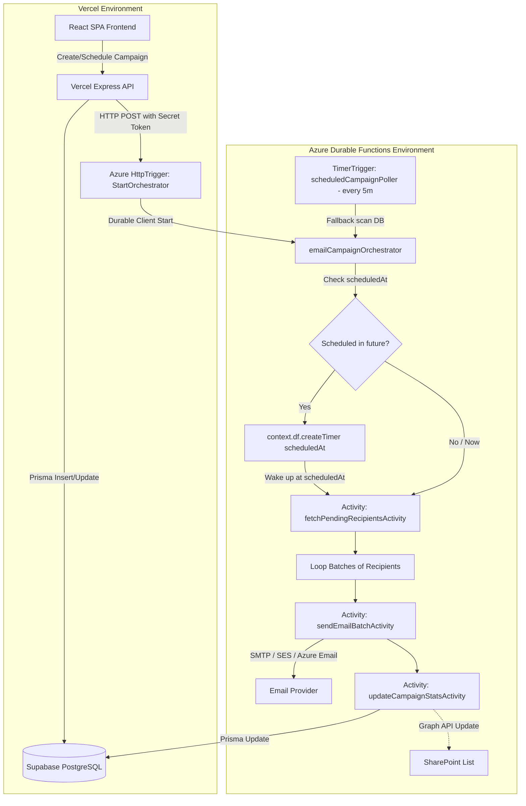

# Design Specification: Azure Durable Functions Email & Scheduling System

**Date:** 2026-08-06  
**Status:** Proposed  
**Scope:** Email Sending & Scheduled Campaign Orchestration via Azure Durable Functions (Node.js v4)

---

## 1. Overview & Goal

The system requires reliable email sending and scheduling functionality. When deployed to **Vercel**, standard background processing (e.g., `setInterval` in `scheduler.js`) and long-running email batching fail due to serverless function execution timeouts (10s/60s) and ephemeral runtime lifespans.

### Architecture Division
* **Vercel (Express / Next.js / Serverless API)**: Serves the React SPA frontend and handles fast REST API CRUD operations (authentication, campaign management, template creation, SharePoint field discovery).
* **Azure Functions App (Node.js v4 + `durable-functions`)**: Dedicated microservice hosted on Azure Function App (Consumption or Elastic Premium plan) that handles:
  1. Immediate email sends & long-running campaign batching.
  2. Scheduled email sends via Durable Orchestration Timers (`createTimer`).
  3. Cron-based safety poller timer trigger as a fallback.
  4. Database status updates & SharePoint sync updates upon email delivery.

---

## 2. Architecture & Data Flow

---

## 3. Azure Function App Components

The Azure Function App project will be structured in `azure-email-function/` or integrated cleanly into `backend/azure-functions/`:

### 3.1 HTTP Start Trigger (`/api/orchestration/start-campaign`)
* **Trigger**: HTTP POST request from Vercel API backend.
* **Header**: `x-azure-secret: process.env.AZURE_FUNCTION_SECRET_KEY` for security.
* **Body**: `{ campaignId: string }`.
* **Action**: Calls `durableClient.startNew('emailCampaignOrchestrator', { instanceId: campaignId, input: { campaignId } })`. Returns orchestration status URL.

### 3.2 Durable Orchestrator (`emailCampaignOrchestrator`)
* **Durable Function Orchestrator**: `df.orchestrator(function* (context))`
* **Steps**:
  1. Fetch campaign metadata from DB via Activity `getCampaignMetadataActivity(campaignId)`.
  2. If `campaign.scheduledAt` > current time:
     * Yield `context.df.createTimer(new Date(campaign.scheduledAt))` (Durable Timer sleeps efficiently with 0 active compute usage).
  3. Set campaign status to `processing` in DB.
  4. Fetch pending recipients in batches (e.g. 50 recipients per batch).
  5. While pending recipients exist:
     * Yield Activity `sendEmailBatchActivity({ campaignId, recipientsBatch })`.
     * Yield Activity `updateCampaignStatsActivity({ campaignId, results })`.
     * Yield optional `context.df.createTimer()` delay for rate-limiting (e.g., 200ms delay between emails).
  6. Finalize campaign status to `completed` or `failed`.

### 3.3 Activity Functions
1. **`getCampaignMetadataActivity`**: Loads campaign, template, and recipient count from Prisma.
2. **`sendEmailBatchActivity`**:
   * Renders Handlebars template for recipient dynamic tags (e.g., `{{Name}}`, `{{email}}`, `{{unsubscribeLink}}`).
   * Sends emails via AWS SES / Nodemailer / `@azure/communication-email`.
   * Returns success/failure statuses per recipient.
3. **`updateCampaignStatsActivity`**:
   * Atomically updates recipient status in Prisma (`sent`, `failed`, `skipped`).
   * Increments `sentCount`, `failedCount`, `pendingCount` in `Campaign` table.
   * If SharePoint integration is configured, calls Graph API `updateSharePointEmailSent()`.

### 3.4 Fallback Cron Timer Trigger (`scheduledCampaignPoller`)
* **Trigger**: `0 */5 * * * *` (Every 5 minutes).
* **Action**: Queries Supabase DB for any campaigns with `status == 'scheduled'` AND `scheduledAt <= NOW()`. If found and not already running in active orchestrations, triggers `startNew` for each.

---

## 4. Vercel Backend Integration (`backend/src/index.js`)

In the main Vercel Express API:
1. When user clicks **"Send Now"**:
   * Update campaign in DB -> `scheduledAt = null`, `status = 'processing'`.
   * Post to `AZURE_FUNCTION_URL/api/orchestration/start-campaign` with `{ campaignId }`.
2. When user clicks **"Schedule Campaign"**:
   * Update campaign in DB -> `scheduledAt = targetDate`, `status = 'scheduled'`.
   * Post to `AZURE_FUNCTION_URL/api/orchestration/start-campaign` with `{ campaignId }`. (The Azure Durable Orchestrator will handle sleeping until `scheduledAt`).

---

## 5. Environment Variables & Security

### Azure Function App Configuration:
* `AZURE_STORAGE_CONNECTION_STRING`: Required for Azure Durable Functions storage provider.
* `DATABASE_URL`: PostgreSQL connection string (Supabase pooled connection).
* `DIRECT_URL`: Supabase direct connection string for Prisma.
* `AZURE_FUNCTION_SECRET_KEY`: Shared secret key for API authentication.
* `AWS_SES_REGION`, `AWS_ACCESS_KEY_ID`, `AWS_SECRET_ACCESS_KEY`, `FROM_EMAIL`: Email gateway credentials.
* `MICROSOFT_GRAPH_*`: SharePoint synchronization credentials.

---

## 6. Verification Plan

1. **Local Emulator Testing**:
   * Run Azurite (local Azure Storage emulator) and Azure Functions Core Tools (`func host start`).
   * Test immediate campaign send endpoint via Vercel backend / Postman.
   * Test scheduled campaign send endpoint with 1-minute delay and verify `createTimer` execution.
2. **Production Vercel & Azure Deployment**:
   * Deploy React frontend & Express API to Vercel.
   * Deploy Azure Durable Function App to Azure Function App (Consumption Plan).
   * Verify end-to-end email delivery and scheduled campaign trigger.
