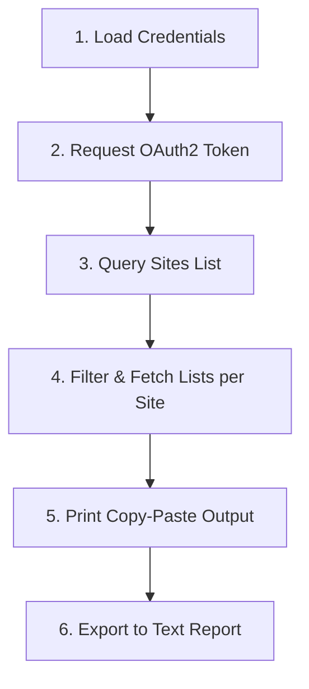

# SharePoint List Auto-Discovery Guide & Technical Design

This guide explains how the PowerShell discovery script ([Find-SharePointLists.ps1](file:///c:/Desire-Mail-Marketing-Sharepoint/tools/Find-SharePointLists.ps1)) automatically retrieves the connection details required to add new SharePoint Lists to the Desire Mail Marketing application.

---

## 1. Required SharePoint Connection Fields
To register a new SharePoint list in the application's **SP Lists** section, you need three main values:
1. **Tenant ID**: The UUID of your Microsoft Entra ID (Azure AD) tenant.
2. **SharePoint Site ID**: A composite string formatted as: `hostname,site-guid,web-guid`.
3. **List ID**: The unique GUID of the specific SharePoint list.

---

## 2. Technical Architecture of the Discovery Script

The PowerShell script acts as a client wrapper around the **Microsoft Graph API**. It automates the extraction of Site IDs and List IDs in six logical phases:



### Phase 1: Load Credentials
The script reads `TENANT_ID`, `SP_CLIENT_ID`, and `SP_CLIENT_SECRET` directly from the backend configuration file:
* **File Path**: `C:\Desire-Mail-Marketing-Sharepoint\backend\.env`
* If any credential is missing from `.env`, the script prompts for manual entry.

### Phase 2: Request Access Token
It sends a `POST` request to the Microsoft Entra ID token endpoint:
* **Endpoint**: `https://login.microsoftonline.com/{TenantId}/oauth2/v2.0/token`
* **Flow**: Client Credentials Flow (Application Identity).
* **Scope**: `https://graph.microsoft.com/.default`

### Phase 3: Site Discovery
Once authenticated, the script searches for all SharePoint sites accessible to the App Registration:
* **Endpoint**: `GET https://graph.microsoft.com/v1.0/sites?search=*`
* **Paging**: Automatically traverses `@odata.nextLink` to retrieve all matching sites.

### Phase 4: List Enumeration & System Filtering
For each discovered site, the script requests its lists:
* **Endpoint**: `GET https://graph.microsoft.com/v1.0/sites/{siteId}/lists`
* **Filtering**: It automatically ignores system/default libraries (e.g. `Style Library`, `Site Pages`, `Site Assets`, and default Document libraries) by checking list templates and display names to keep the output clean.

---

## 3. How to Run the Script

### Execution Steps:
1. Open a PowerShell terminal (no Administrator privileges required).
2. Change directory to the workspace root:
   ```powershell
   cd C:\Desire-Mail-Marketing-Sharepoint
   ```
3. Run the script with bypass execution policy:
   ```powershell
   powershell -ExecutionPolicy Bypass -File .\tools\Find-SharePointLists.ps1
   ```

---

## 4. Understanding and Using the Output

When the script finishes running, it outputs a grouped list of custom lists per site, along with a saved report:

### Terminal Output Example:
```text
  SITE   : t12y7
  URL    : https://t12y7.sharepoint.com/sites/Marketing

  SharePoint Site ID (use this same value for ALL lists in this site):
  t12y7.sharepoint.com,25ddce10-9f81-4a0a-a28c-8c50b1338496,1af8fbbf-5b8f-4b68-bf05-0159ea4d1333

  List : Marketing Contacts
    List ID       : 6a0c9cb8-aa15-48f4-b242-62041a87f29a
    Items in list : 43
```

### Form Input Mapping:
Open your browser to `http://localhost:5173/settings/sharepoint` and click **Add List**. Map the values as follows:

| Form Field | Source from Script | Description |
|---|---|---|
| **Display Name** | Your choice (e.g., "Marketing Contacts") | Friendly name visible in the sync dropdown. |
| **SharePoint Site ID** | `SharePoint Site ID` | The full composite string starting with your hostname. |
| **List ID** | `List ID` | The GUID of the target list. |
| **Tenant ID** | Leave blank | Defaults to the `.env` value. |
| **Client ID** | Leave blank | Defaults to the `.env` value. |
| **Client Secret** | Leave blank | Defaults to the `.env` value. |

---

## 5. Troubleshooting & Permission Requirements

If the script fails at **Step 3 (Site Discovery)**, the Azure App Registration lacks Graph API application permissions:

### Resolution Steps:
1. Navigate to the [Azure Portal](https://portal.azure.com) → **Microsoft Entra ID** → **App Registrations**.
2. Select your app registration: `bad236d4-c2af-4e11-8472-3346413e3235`.
3. Select **API permissions** in the sidebar → click **Add a permission**.
4. Choose **Microsoft Graph** → **Application permissions**.
5. Find and check **`Sites.Read.All`**.
6. Click **Grant admin consent** for your organization.
7. Allow 1-2 minutes for token replication, then run the script again.
